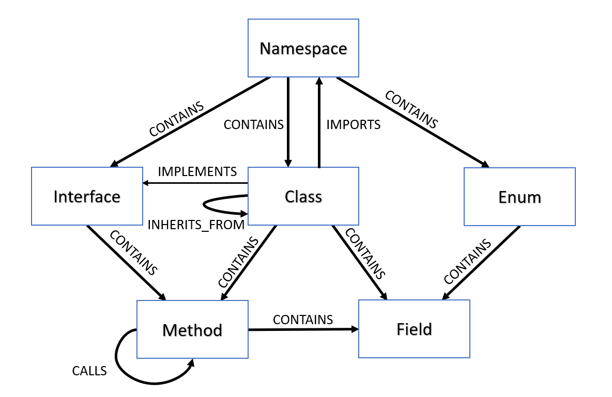
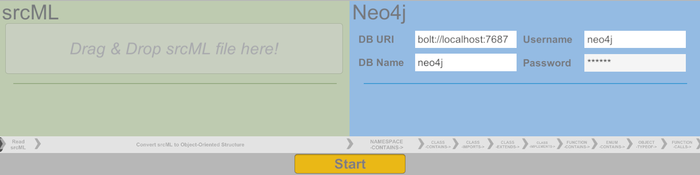

# Src2Neo

This tool converts a [srcML](https://github.com/srcML/srcML) xml-file to a object-oriented data structure (OOS) and writes this structure into a Neo4j database.

> Note: This tool is work-in-progress 🚧 It is very likely that the resulting database might miss nodes and relationships.

> Note: While this tool already detects the file language (C#, Java, C++), only C# files is currently supported.

The meta model of the src2Neo graph database.

# How to Use

> Note: You can either run the tool from the Unity editor or you can built the tool und run the .exe. 

> Note: Only the built variant supports srcML drag&drop. When running the tool from the editor, a srcML selection window appears after pressing the Start button.

1. Make sure you have a Neo4j server & database running. 

2. Drag & Drop the srcML XML-file into the application. (Built version only!)

3. Put in the information of your running (!) Neo4j server & database.

4. Change settings, i.e. toggles, if required.

5. Press __Start__ button and wait until conversation is done and the data is written into the Neo4j database.
